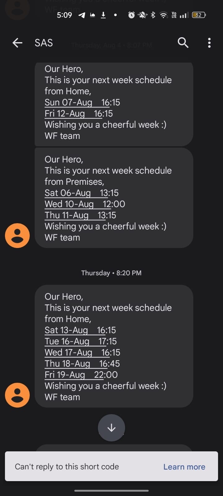
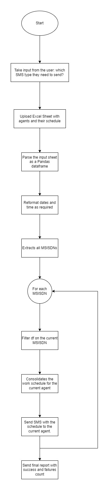

[![LinkedIn][linkedin-shield]][linkedin-url]

<!-- PROJECT LOGO -->
 

  
  <h3 align="center">Automated SAS (Send Agent's Schedule) Procedure</h3>

<!-- TABLE OF CONTENTS -->

  
Table of Contents

  <ol>
    <li>
      <a href="#about-the-project">About The Project</a>
      <ul>
        <li><a href="#business-case">Business Case</a></li>
        <li><a href="#technical-solution">Technical Solution</a></li>
        <li><a href="#flowchart">Flowchart</a></li> <!-- Only if present -->
        <li><a href="#tech-stack">Tech Stack</a></li>
      </ul>
    </li>
    <li><a href="#contact">Contact</a></li>
  </ol>

<!-- ABOUT THE PROJECT -->
## About The Project

* **Project Name:** Automated SAS (Send Agent's Schedule) Procedure  
* **Version:** v1.0.0  
* **Department:** Technology

---

### Business Case

The WorkForce team sends weekly schedules of agents through SMS. Each agent receives three types of SMS:
* Work from Home Schedule
* Work from Premises Schedule
* No Show Schedule

This project automates the process, reducing manual effort and ensuring timely delivery of the schedules.

(<a href="#readme-top">back to top</a>)

### Technical Solution

This web application automates the SAS (Send Agent's Schedule) procedure, which was previously managed by the workforce team manually. 

The project is hosted as a Django web application and takes two inputs from the user:
* **SMS Type:**  
  * Work from Home Schedule  
  * Work from Premises Schedule  
  * No Show Schedule  
* **Excel Sheet:**  
  * Agent name  
  * Agent mobile number  
  * Next week’s schedule (separate row for each working day)  

The application consolidates the input data, processes it, and calls a procedure in the Oracle database, which then sends the SMSs to the agents.

(<a href="#readme-top">back to top</a>)

### Flowchart

(<a href="#readme-top">back to top</a>)

### Tech Stack

This project was developed using the following tech stack:

* **Python**
* **SQL**

(<a href="#readme-top">back to top</a>)

<!-- CONTACT -->
## Contact

Mohamed AbdelGawad Ibrahim - [@m-abdelgawad](https://www.linkedin.com/in/m-abdelgawad/) - <a href="tel:+201069052620">+201069052620</a>

(<a href="#readme-top">back to top</a>)

<!-- MARKDOWN LINKS & IMAGES -->
[linkedin-shield]: https://img.shields.io/badge/-LinkedIn-black.svg?style=for-the-badge&logo=linkedin&colorB=555
[linkedin-url]: https://www.linkedin.com/in/m-abdelgawad/
